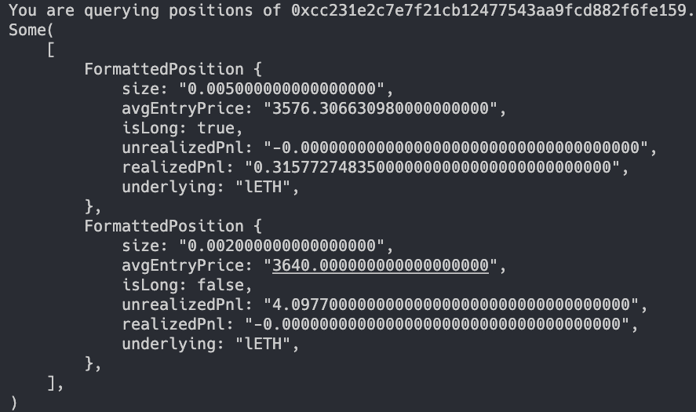

# Linear Finance Perpetual PnL CLI Tool

A CLI tool to query users' profit and loss in Perpetual of [Linear Finance](https://linear.finance/) written in Rust.

## How to use?
```
cargo run -- --user 0xffffffffffffffffffffffffffffffffffffffff
```

## Result
<p align="center">
  
</p>

## License

[MIT](./LICENSE)
